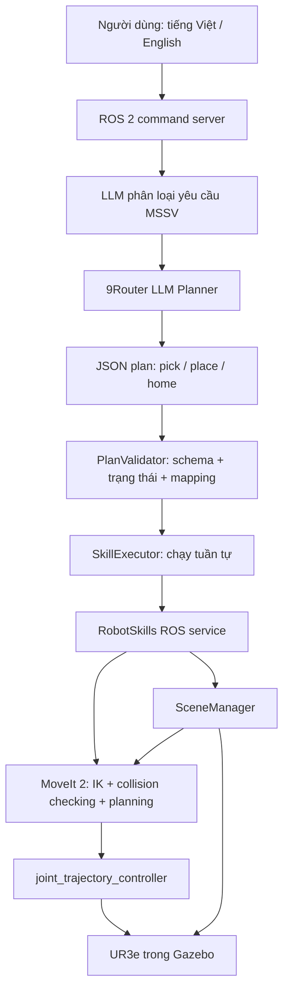

# Bài thực hành 02 — Điều khiển UR3e bằng LLM và Skill-based Planning

Project xây dựng hệ thống điều khiển UR3e trong Gazebo Fortress bằng ROS 2 Humble, MoveIt 2 và 9Router. Người dùng nhập câu lệnh tiếng Việt hoặc tiếng Anh; LLM chỉ lập kế hoạch từ các skill cho phép. `PlanValidator` kiểm tra toàn bộ kế hoạch và trạng thái trước khi robot bắt đầu di chuyển. MoveIt lập kế hoạch, kiểm tra va chạm và thực thi chuyển động.

## Thông tin sinh viên và nhiệm vụ cá nhân

| Sinh viên | MSSV | XX | P = XX mod 6 |
|---|---:|---:|---:|
| Kieu Minh Dung | 23020729 | 29 | 5 |

Theo bảng của đề bài, nhiệm vụ là **Zone A → Blue, Zone B → Yellow, Zone C → Red**. Danh tính và phép tính được lưu trong [`config/student_config.yaml`](config/student_config.yaml); chương trình tính ánh xạ bằng code, không yêu cầu LLM tự tính MSSV.


*Ảnh chụp trực tiếp từ Gazebo Fortress của project hiện tại, ở trạng thái khởi tạo với các phôi tại vị trí nguồn. Ảnh minh họa scene, không phải bằng chứng cho một lần gọi live LLM.*

## Kiến trúc chương trình



Luồng xử lý là **câu lệnh → LLM → JSON plan → kiểm tra hợp lệ → thực thi skill → MoveIt → robot mô phỏng**. LLM không sinh joint trajectory, góc khớp, mã điều khiển hay lệnh cho controller. Kế hoạch JSON không được tự sửa để “đoán ý”: thiếu tham số, sai thứ tự, thiếu `home()` cuối hoặc JSON hỏng đều bị từ chối trước khi thực thi. Plan rỗng cũng bị validator từ chối.

Các thành phần chính:

- `ur3_llm_control/llm_planner.py`: gọi 9Router để phân loại ý định sinh viên và nhận JSON plan.
- `ur3_llm_control/task_validator.py`: kiểm tra schema, skill/object/zone, trạng thái đang giữ vật, ô đích đã chiếm và mapping MSSV.
- `ur3_llm_control/skill_executor.py`: lần lượt gọi các skill, dừng nếu có bước thất bại.
- `src/robot_skills_node.cpp`: cài đặt `home()`, `pick(object)`, `place(object, zone)` bằng MoveIt.
- `src/scene_manager.cpp`: quản lý vật thể trong Planning Scene và đồng bộ pose mô phỏng với Gazebo.
- `command_cli --reset-scene`: tiện ích demo thủ công, không phải skill LLM.

## Môi trường và build

Đã kiểm tra trên Ubuntu 22.04, ROS 2 Humble, UR3e, Gazebo Fortress và MoveIt 2. Workspace phụ thuộc bản cài `ur_simulation_gz` có sẵn trong `~/ros2_ws`.

```bash
cd ~/HRI/ur3_LLM_b2
source /opt/ros/humble/setup.bash
source ~/ros2_ws/install/setup.bash
colcon build --symlink-install
source install/setup.bash
```

Các thư mục `build/`, `install/` và `log/` được giữ cục bộ để build nhanh hơn, được Git ignore và không được commit. Nếu clone project trên máy khác thì chạy build ở trên để tạo lại chúng.

## Cấu hình 9Router

Cần chạy 9Router và cấu hình ba biến môi trường trong **terminal sẽ khởi chạy ROS command server**. Không ghi API key vào source code, README, YAML hoặc command argument. Khi `read -rsp` hỏi key, terminal không hiện ký tự lúc gõ/dán; nhấn Enter sau khi dán xong.

```bash
export NINEROUTER_BASE_URL=http://localhost:20128/v1
export NINEROUTER_MODEL=ag/gemini-3.8-flash-medium
read -rsp '9Router API key: ' NINEROUTER_API_KEY; echo
export NINEROUTER_API_KEY
```

CLI gửi yêu cầu tới ROS server; biến môi trường trong terminal CLI không tự truyền sang server đang chạy ở terminal khác. Nếu thay đổi biến, hãy khởi chạy lại command server từ terminal đã cấu hình.

## Chạy mô phỏng

Terminal 1: cấu hình router, source các workspace rồi khởi chạy toàn bộ UR3e, Gazebo, MoveIt và ứng dụng:

```bash
cd ~/HRI/ur3_LLM_b2
source /opt/ros/humble/setup.bash
source ~/ros2_ws/install/setup.bash
source install/setup.bash
# Export ba biến 9Router như mục trên trước khi chạy launch.
ros2 launch ur3_llm_control llm_robot.launch.py
```

Mặc định Gazebo GUI và RViz được mở. Chờ log `READY`, `Scene initialized` và service `/llm/command` trước khi gửi task. Chỉ chạy một stack trên mỗi ROS domain.

Terminal 2: source workspace rồi gửi câu lệnh. Ví dụ cơ bản:

```bash
cd ~/HRI/ur3_LLM_b2
source /opt/ros/humble/setup.bash
source ~/ros2_ws/install/setup.bash
source install/setup.bash
ros2 run ur3_llm_control command_cli 'Đưa khối màu đỏ vào vùng B.'
```

Các cách diễn đạt khác cũng được gửi tới LLM, không ánh xạ cứng câu chữ thành hành động:

```bash
ros2 run ur3_llm_control command_cli 'Hãy lấy khối màu vàng và đặt nó vào ô A.'
ros2 run ur3_llm_control command_cli 'Move the blue cube to zone C.'
```

Terminal cần hiển thị `USER COMMAND`, `LLM PLAN`, `VALIDATION`, `EXECUTION` và `TASK_SUCCESS`. Ví dụ kế hoạch cho yêu cầu đỏ → B:

```text
1. pick(red_cube)
2. place(red_cube, zone_b)
3. home()
```

Chạy nhiệm vụ MSSV theo mapping trong file cấu hình:

```bash
ros2 run ur3_llm_control command_cli --student-task \
  'Arrange all objects according to my student ID.'
```

`--student-task` buộc validator xác nhận trạng thái cuối khớp chính xác mapping cá nhân. LLM vẫn tự sinh và sắp xếp các bước; chương trình không đưa sẵn thứ tự skill cho LLM.

## Robot skills và an toàn

Các skill được phép là:

- `home()`: MoveIt lập kế hoạch tới tư thế `up` trong SRDF.
- `pick(object)`: tiếp cận và đi xuống bằng đường Cartesian đã kiểm tra; sau đó gắn phôi vào end-effector trong MoveIt.
- `place(object, zone)`: di chuyển tới khay, đi xuống, tháo phôi khỏi trạng thái attached và cập nhật vị trí đặt.

Mỗi skill trả trạng thái như `SUCCESS`, `PLANNING_FAILED`, `EXECUTION_FAILED`, `INVALID_OBJECT` hoặc `INVALID_ZONE`. Validator kiểm tra toàn bộ plan trước bước đầu tiên; executor dừng tại lỗi đầu tiên. MoveIt xử lý IK, joint limits, self-collision và collision với bàn, phôi, khay. Các đoạn Cartesian chỉ chạy khi đường đi đầy đủ và vượt qua kiểm tra va chạm/joint jump.

Scene có một UR3e, bàn, ba cube và ba khay xám có nhãn A/B/C. Kích thước/vị trí cấu hình tại [`config/scene.yaml`](config/scene.yaml), dùng để tạo vật thể Gazebo và collision geometry cho MoveIt. Hệ thống ưu tiên đường Cartesian ngắn và an toàn; không tuyên bố tối ưu toàn cục.

**Giới hạn mô phỏng gắp:** model UR3e đang dùng không có ngón gắp hoặc gripper controller. Vì vậy project biểu diễn thao tác gắp bằng trạng thái attached trong MoveIt và đồng bộ pose của cube trong Gazebo. Đây là simulated grasp, không phải mô phỏng lực kẹp, trượt hoặc rơi vật lý.

Nếu các vùng đích đã bị chiếm, chương trình dùng các vùng trống để sắp xếp lại khi có thể. Chu trình hoán đổi mà cả ba khay đều đã kín không có vùng tạm trong bộ skill hiện tại nên bị từ chối an toàn trước khi robot chạy.

## Reset scene cho các lần demo tiếp theo

Sau khi hoàn tất một task, trả robot về home và đưa cả ba cube về vị trí source mà không restart Gazebo:

```bash
ros2 run ur3_llm_control command_cli --reset-scene
```

Đây là tiện ích demo xác định, không gọi LLM và không nằm trong vocabulary của robot skill. Reset chỉ được chấp nhận khi không có phôi đang được giữ và scene còn khỏe. Chương trình đồng bộ lại pose cube giữa Gazebo, MoveIt Planning Scene và trạng thái logic.

Ví dụ: chạy bài MSSV, reset scene, rồi thử một yêu cầu đơn vật thể khác.

## Kiểm thử và kết quả

```bash
PYTEST_DISABLE_PLUGIN_AUTOLOAD=1 python3 -m pytest -q test
colcon test
colcon test-result --verbose
# Các smoke test sau cần mô phỏng đang chạy:
ros2 run ur3_llm_control check_scene
ros2 run ur3_llm_control robot_smoke_test
ros2 run ur3_llm_control mapping_smoke_test --permutation 0
```

Kết quả offline hiện tại: **81 pytest pass**; **82 colcon test pass**, không lỗi/failure/skip. Bộ kiểm thử Gazebo/MoveIt đã chạy sáu scene mới, gồm 27 lần pick, 27 lần place, các chuyển động giữa nguồn và khay, các lần chuyển giữa các khay và 44 trường hợp plan không hợp lệ bị chặn. Reset scene cũng được kiểm tra bằng truy vấn độc lập tới Gazebo và MoveIt; sau reset, blue cube đã được đặt vào zone C thành công trong cùng tiến trình Gazebo. Chi tiết và log chọn lọc ở [`docs/VERIFICATION.md`](docs/VERIFICATION.md) và [`docs/reset_scene_verified.txt`](docs/reset_scene_verified.txt).

**Trạng thái kiểm thử LLM:** live 9Router English/Vietnamese và task MSSV từ LLM tới Gazebo hiện ghi **NOT VERIFIED** trong phiên review cuối vì shell review không có ba biến `NINEROUTER_*`. Bộ kiểm thử deterministic không thay thế kiểm thử live LLM; khi demo cần chạy router thật và ghi lại output/video.

## Tài liệu và mã nguồn

- [`docs/PRESENTATION_GUIDE.md`](docs/PRESENTATION_GUIDE.md): hướng dẫn giải thích chương trình khi trình bày.
- [`docs/VERIFICATION.md`](docs/VERIFICATION.md): trạng thái test và phạm vi kiểm chứng.
- [`docs/FILES.md`](docs/FILES.md): danh mục source và tài liệu.
- Repository: [HRI_k68e-re](https://github.com/kieudung12/HRI_k68e-re), branch `assignments_2`.
- Video demo: *chưa có — bổ sung liên kết sau khi quay demo live LLM.*
