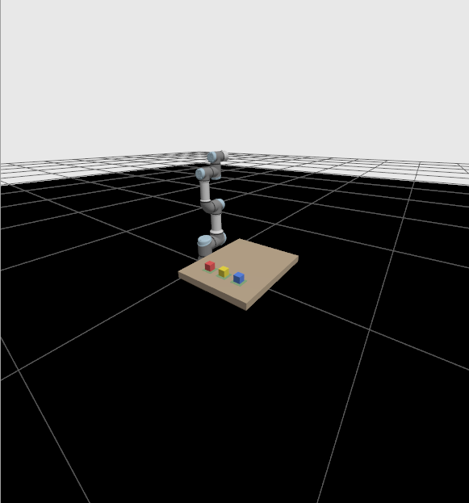
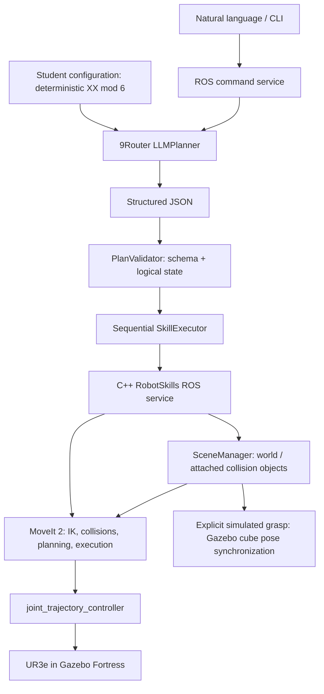

# Bài thực hành 02 – Điều khiển UR3 bằng LLM và Skill-based Planning

This self-contained ROS 2 package turns English or Vietnamese commands into validated UR3e pick/place skills in Gazebo Fortress. The LLM selects skills; MoveIt computes and executes all task motion.

| Student | Student ID | XX | P |
|---|---:|---:|---:|
| Kieu Minh Dung | 23020729 | 29 | 5 |

**Required assignment:** Zone A → Blue (`blue_cube`), Zone B → Yellow (`yellow_cube`), Zone C → Red (`red_cube`). The configured values are in `config/student_config.yaml`. See [PROJECT_STATUS.md](PROJECT_STATUS.md) for current test results and unverified work; a successful build alone is not proof of robot execution.

Verified robot and multi-object results: [verification record](docs/VERIFICATION.md).



Earlier deterministic P=0 regression image; it does not show the configured P=5 LLM task.

## Architecture



Python modules implement `LLMPlanner`, `PlanValidator`, `SkillExecutor`, student mapping, and the command interface. The C++ process contains `RobotSkills` and `SceneManager`. MoveIt callbacks run independently of serialized skill callbacks, so waiting for a trajectory does not block joint-state feedback.

ROS endpoints:

| Endpoint | Type | Purpose |
|---|---|---|
| `/llm/command` | `ur3_llm_control/srv/ExecuteCommand` | Natural language or structured plan; whole-plan validation |
| `/robot_skills/state` | `ur3_llm_control/srv/GetState` | Authoritative logical state and revision |
| `/robot_skills/execute` | `ur3_llm_control/srv/ExecuteSkill` | Deterministic single-skill diagnostic/backend |
| `/robot_skills/reset_scene` | `ur3_llm_control/srv/ResetScene` | Manual demo reset; not an LLM skill |
| `/joint_trajectory_controller/follow_joint_trajectory` | `control_msgs/action/FollowJointTrajectory` | MoveIt trajectory execution |

The single-skill service is a developer diagnostic, not the natural-language entry point. It checks skill arguments and current state independently. Every application plan passes full validation before its first skill. Revision checks reject state changes between validation and execution. Concurrent application commands return `BUSY`. A failed skill stops the plan. Motion/planning/grasp faults require inspecting and restarting the complete simulation.

## Files

```text
config/                   scene, skills, controllers, student config, basic JSON plan
prompt/planner_prompt.txt  strict allowed-skill prompt
ur3_llm_control/           Python planner, validator, executor, ROS server and CLI
include/ur3_llm_control/   C++ SceneManager declaration
src/                      MoveIt skill server and SceneManager
srv/                      ROS command, skill and state contracts
launch/                   complete stack and application-only launch
worlds/assignment2.sdf     local Fortress world; no downloaded models
scripts/                  entry points, preserved 9Router diagnostic, scene audit
test/                    deterministic offline tests (no LLM or robot required)
docs/                     verification notes
PROJECT_STATUS.md         live engineering diary
```

## Dependencies and build

Tested environment: Ubuntu 22.04, ROS 2 Humble, UR3e, Gazebo Fortress 6.18, MoveIt 2.5.10, `ur_simulation_gz`, `ur_moveit_config`, `ros_gz_sim`, `ros_gz_bridge`, ros2_control, C++17, YAML-CPP, Ignition Transport 11 / Msgs 8, Python requests/PyYAML/pytest, and 9Router.

`ur_simulation_gz` is already installed in this machine's normal `~/ros2_ws` overlay. This package does not depend on Assignment 1 or its absolute paths. In a new shell, source the overlay if `ros2 pkg prefix ur_simulation_gz` cannot find it.

```bash
cd ~/HRI/ur3_LLM_b2
source /opt/ros/humble/setup.bash
# If needed for the normally installed UR simulation dependency:
source ~/ros2_ws/install/setup.bash
colcon build --symlink-install
source install/setup.bash
```

If dependency checks fail on another machine, inspect first:

```bash
rosdep check --from-paths . --ignore-src --rosdistro humble
# Install only the reported missing dependencies when appropriate:
rosdep install --from-paths . --ignore-src -r -y --rosdistro humble
```

## 9Router environment

The existing local router endpoint is `http://localhost:20128/v1`; runtime model is `ag/gemini-3.8-flash-medium`. The **terminal launching the command server** must have all three variables. The CLI sends commands through ROS; its environment is not forwarded to a server that is already running.

```bash
export NINEROUTER_BASE_URL=http://localhost:20128/v1
export NINEROUTER_MODEL=ag/gemini-3.8-flash-medium
read -rsp '9Router API key: ' NINEROUTER_API_KEY; echo
export NINEROUTER_API_KEY
```

Never put the real key into this repository, a command argument, tracked YAML, screenshots, or documentation. The planner sends `stream: false` and reports missing configuration, connection, timeout, HTTP, response-envelope and JSON errors without logging headers or response bodies. The original `scripts/test_9router.py` remains unchanged as a standalone manual integration diagnostic.

## Launch

Terminal 1, after sourcing the installation and exporting router variables:

```bash
ros2 launch ur3_llm_control llm_robot.launch.py
# Optional visual demo:
ros2 launch ur3_llm_control llm_robot.launch.py gui:=true rviz:=true
```

Verification processes are stopped in the delivered workspace. Start a fresh scene using the commands above. Use only one launch at a time. GUI and RViz open by default; for headless runs pass `gui:=false rviz:=false`. In the GUI, double-click `ur` in the Entity Tree to focus the camera. Wait for `READY`, `Scene initialized`, and the `/llm/command` service before sending commands. No LLM task or pick/place starts automatically.

For separate stack/application troubleshooting:

```bash
ros2 launch ur3_llm_control llm_robot.launch.py application:=false
# In another sourced terminal, same Gazebo partition:
export IGN_PARTITION=ur3_assignment2
ros2 launch ur3_llm_control application.launch.py
```

The application-only launch expects this package's world, controllers and MoveIt to be running. Its scene initialization rejects an existing assignment collision scene to avoid silently resetting object state. Restart the entire stack for a fresh scene.

The launch adapts Assignment 1's controller recovery and fixed startup hold. That fixed hold uses the ROS trajectory action only during bringup; it is never LLM-controlled. All `home`, `pick` and `place` motions use MoveIt. The delayed spawn retry first checks ROS discovery; it never intentionally duplicates the robot. Only `joint_state_broadcaster` and `joint_trajectory_controller` are configured.

Shutdown: Ctrl+C the launch. If the upstream Fortress launcher leaves a child server running, stop the same partition explicitly before relaunching:

```bash
IGN_PARTITION=ur3_assignment2 ign service -s /server_control \
  --reqtype ignition.msgs.ServerControl --reptype ignition.msgs.Boolean \
  --timeout 3000 --req 'stop: true'
```

## Demos

Terminal 2:

```bash
cd ~/HRI/ur3_LLM_b2
source install/setup.bash
ros2 run ur3_llm_control command_cli 'Put the red cube in zone B.'
ros2 run ur3_llm_control command_cli 'Đưa vật màu đỏ sang vùng B.'
ros2 run ur3_llm_control command_cli 'Hãy lấy khối màu vàng và đặt nó vào ô A.'
ros2 run ur3_llm_control command_cli 'Move the blue cube to zone C.'
# Or interactive input:
ros2 run ur3_llm_control command_cli
```

Commands operate on the current scene. An occupied destination causes validation to reject the entire plan before movement. To test planning without motion, add `--dry-run`.

First test the deterministic pipeline without 9Router:

```bash
ros2 run ur3_llm_control command_cli --plan-file config/basic_plan.json
```

Direct single-skill diagnostics, in this order, without LLM:

```bash
ros2 service call /robot_skills/execute ur3_llm_control/srv/ExecuteSkill '{skill: home}'
ros2 service call /robot_skills/execute ur3_llm_control/srv/ExecuteSkill '{skill: pick, object: red_cube}'
ros2 service call /robot_skills/execute ur3_llm_control/srv/ExecuteSkill '{skill: place, object: red_cube, zone: zone_b}'
ros2 service call /robot_skills/state ur3_llm_control/srv/GetState '{}'
```

Expected successful application output (only when all skills actually succeed):

```text
USER COMMAND
Put the red cube in zone B.
LLM PLAN
1. pick(red_cube)
2. place(red_cube, zone_b)
3. home()
VALIDATION
VALID
EXECUTION
... SUCCESS
TASK_SUCCESS
FINAL STATE: ... red_cube: zone_b ... held_object: null ...
```

## Skills, validation and grasp

Allowed JSON is exactly `{"plan": [...]}`. Allowed steps are `pick(object)`, `place(object, zone)`, and `home()`. Unknown fields, joint data, trajectories, velocities and arbitrary code are rejected. Objects are exactly `red_cube`, `yellow_cube`, `blue_cube`; zones are exactly `zone_a`, `zone_b`, `zone_c`.

The validator tracks held object, object locations and zone occupancy. It rejects place-before-pick, a second pick while holding, mismatched place objects, occupied zones, incomplete plans, stale/faulted state, and student plans that do not reach the required mapping. Empty plans are rejected. State is copied during validation; validation itself has no side effects.

`home()` plans to the UR SRDF named target `up`. `pick()` moves above the cube, descends, attaches, and retreats. `place()` moves above the zone, descends, detaches into the world, and retreats. Pose targets use collision-aware IK with current-state seeds. The full vertical approach is prevalidated before moving to hover, with bounded retries over IK seeds. Cartesian segments require complete paths, collision checking, angles unwrapped from measured joints, bounded joint jumps and explicit retiming at configured velocity/acceleration scaling (default 0.25).

The end-effector is discovered from `MoveGroupInterface`, not hard-coded. This machine reported `tool0`, planning frame `world`, group `ur_manipulator`. The UR model defines tool +Z as forward. Quaternion `[1, 0, 0, 0]` points that axis downward. All six pickup/placement targets and their six hover targets are checked using collision-aware IK by `check_scene`.

**There is no physical gripper or gripper controller on this UR3e model.** This is an explicit simulated grasp abstraction, not a claimed physical grasp. A virtual 15 cm tool-to-cube-center offset leaves clearance from the wrist. MoveIt represents the cube as WORLD before pick, ATTACHED during carry, and WORLD at its destination after place. Native atomic attachment transitions and post-update queries prevent duplicate collision representations. Only the attachment link is a touch link; the table and other objects remain collidable.

Gazebo cubes are static, pose-driven bodies. `SceneManager` uses native Ignition Transport `set_pose` with tool TF at approximately 20 Hz while carrying; it checks acknowledgments and TF freshness. The arm is never teleported. Release sets the deterministic zone pose. This abstraction does not simulate finger contact, grasp force, slip, or dropped-object physics. Table and cube sizes and positions come from the same `scene.yaml` for both engines. Cube centers include 3 mm clearance over the tabletop to avoid numerical contact ambiguity.

## Student-ID task and occupied zones

The configured ID is **23020729**, so `XX = 29` and `P = 29 mod 6 = 5`. The required mapping is **Zone A → Blue, Zone B → Yellow, Zone C → Red**. Python calculates that mapping deterministically. The LLM receives only the trusted mapping and current world state; it classifies whether a normal-language request is student-specific, then chooses and orders the allowed skills itself. No computed skill sequence is sent to the LLM. Student-specific plans are independently validated against the complete mapping before execution.

Basic English command:

```bash
ros2 run ur3_llm_control command_cli \
  'Put the red cube in zone B.'
```

Vietnamese command:

```bash
ros2 run ur3_llm_control command_cli \
  'Hãy lấy khối màu vàng và đặt nó vào vùng A.'
```

Advanced student-specific request works without a special flag:

```bash
ros2 run ur3_llm_control command_cli \
  'Arrange all objects according to my student ID.'
```

`--student-task` remains available as strict mode. It explicitly requires the configured student mapping regardless of the wording supplied:

```bash
ros2 run ur3_llm_control command_cli --student-task \
  'Arrange all objects according to my student ID.'
```

| P | zone_a | zone_b | zone_c |
|---|---|---|---|
| 0 | red_cube | yellow_cube | blue_cube |
| 1 | red_cube | blue_cube | yellow_cube |
| 2 | yellow_cube | red_cube | blue_cube |
| 3 | yellow_cube | blue_cube | red_cube |
| 4 | blue_cube | red_cube | yellow_cube |
| 5 | blue_cube | yellow_cube | red_cube |

Occupied-zone strategy: deterministic safe reordering into currently empty destinations. Picking frees the previous zone; already-correct objects stay in place. A fully occupied permutation cycle has no legal free destination under this three-zone skill vocabulary, so the task is rejected **before motion**. No staging pose is implemented; restart the scene for such a rearrangement. This limitation is explicit and unit-tested.

## Reset scene for repeated demos

After a completed task, restore all cubes to their configured source poses without restarting Gazebo:

```bash
ros2 run ur3_llm_control command_cli --reset-scene
```

This deterministic demo utility moves the robot home through MoveIt, requires that no object is held, restores all three cube models to their configured source poses, synchronizes Gazebo and the MoveIt Planning Scene, and resets logical `object_locations` to `source`. It does not use the LLM and is not part of the task-plan skill vocabulary (`pick`, `place`, `home`). Reset is allowed only when the scene is healthy.

Example repeated-demo flow:

1. `ros2 run ur3_llm_control command_cli --student-task 'Arrange all objects according to my student ID.'`
2. `ros2 run ur3_llm_control command_cli --reset-scene`
3. `ros2 run ur3_llm_control command_cli 'Move the red cube to zone B.'`

## Tests and troubleshooting

```bash
colcon test
colcon test-result --verbose
# Direct offline test run, insulated from unrelated user-installed pytest plugins:
PYTEST_DISABLE_PLUGIN_AUTOLOAD=1 python3 -m pytest -q test
# Running simulation required; performs no motion:
ros2 run ur3_llm_control check_scene
# Moves the simulated robot through home/pick/place/home:
ros2 run ur3_llm_control robot_smoke_test
# Synthetic multi-object fixture, no LLM/student identity (moves the robot):
ros2 run ur3_llm_control mapping_smoke_test --permutation 0
# Separate reusable-planner live test (English + Vietnamese):
ros2 run ur3_llm_control planner_integration_test
# Original standalone live router diagnostic; requires all three environment variables:
python3 scripts/test_9router.py
```

`check_scene` verifies all approach/grasp IK targets with collision checking enabled, then uses a read-only invalid-state probe to prove the table participates in collision checking. The normal tests require neither ROS runtime nor 9Router. Actual robot/LLM results are in the status diary; expected output above is not a test claim.

- Missing `ur_simulation_gz`: source its normal workspace installation; never source Assignment 1 as an application dependency.
- Missing router variables: export them before launching the command server, then restart it.
- Controller readiness failure: inspect `ros2 control list_controllers`, `/joint_states`, `/clock`, and competing old Gazebo servers. Do not start multiple stacks on the same ROS domain.
- `PLANNING_FAILED`, `EXECUTION_FAILED`, `GRASP_FAILED`, or synchronization failure: execution stops; inspect the reported state and restart the complete simulation before another task. Never bypass a failed check.
- ROS service timeout: the robot may still be executing. The command server blocks retries after uncertain execution. Stop/inspect the simulation first.
- Start only one complete launch on a ROS domain. During normal use, `Ctrl+C` stops the launch; MoveIt Humble may print a known callback-group destruction segmentation fault during shutdown after successful operation. If a crash occurs before `READY` or while executing motion, inspect the first error above the shutdown messages.
- `No 3D sensor plugin(s) defined for octomap updates`: expected without a camera; deterministic collision objects are still used.
- External pytest plugin errors (`_pytest.scope`): use `PYTEST_DISABLE_PLUGIN_AUTOLOAD=1`. The CMake test already sets it.
- Keep simulated clocks running. Paused/stopped Gazebo can make upstream MoveIt state waits stall; unpause or stop the full launch.

Known limits: predefined poses; no vision; simulated attachment instead of physical grasp; no occupied-cycle staging; no automatic recovery from partially executed robot tasks; GUI behavior and live router/identity-specific tests are claimed only if marked PASS in `PROJECT_STATUS.md`.

Submission repository: https://github.com/kieudung12/HRI_k68e-re.git. Assignment 2 uses `assignments_2`; Assignment 1 on `main` is preserved. No automatic push.

Video: **TODO — add the final demonstration link.**
