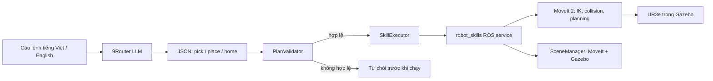

# Bài thực hành 02 — Điều khiển UR3e bằng LLM và Skill-based Planning

Project điều khiển UR3e trong Gazebo Fortress bằng ROS 2 Humble và MoveIt 2. Người dùng gửi câu lệnh tiếng Việt hoặc tiếng Anh; 9Router chuyển yêu cầu thành kế hoạch JSON gồm các skill được phép. `PlanValidator` kiểm tra toàn bộ kế hoạch và trạng thái trước khi bất kỳ skill nào chạy. MoveIt lập kế hoạch chuyển động có kiểm tra va chạm rồi thực thi trên robot mô phỏng.

## Thông tin sinh viên

| Sinh viên | MSSV | XX | P = XX mod 6 |
|---|---:|---:|---:|
| Kieu Minh Dung | 23020729 | 29 | 5 |

Mapping bài cá nhân: **Zone A → Blue, Zone B → Yellow, Zone C → Red**. Chương trình tính mapping từ [`config/student_config.yaml`](config/student_config.yaml); LLM không tự tính MSSV.


*Ảnh scene Gazebo ở trạng thái khởi tạo; ảnh minh họa mô hình, không phải bằng chứng cho một lần gọi live LLM.*

## Kiến trúc



LLM chỉ chọn và sắp xếp `pick(object)`, `place(object, zone)`, `home()`. LLM không sinh joint value, trajectory, velocity, mã điều khiển hay lệnh controller. Validator kiểm tra whitelist, schema chính xác, trạng thái đang giữ vật, khay đã chiếm, mapping sinh viên, revision và fault. Plan sai có thể được yêu cầu lập lại tối đa hai lần; mỗi plan mới vẫn phải qua validator. `{"plan":[]}` là tín hiệu từ chối: bị báo lỗi rõ ràng, không retry cùng phản hồi, không tự thêm skill và không thực thi robot.

## Build và khởi chạy

Workspace phụ thuộc các gói UR đã cài trong `~/ros2_ws`.

```bash
cd ~/HRI/ur3_LLM_b2
source /opt/ros/humble/setup.bash
source ~/ros2_ws/install/setup.bash
colcon build --symlink-install
source install/setup.bash
```

Giữ nguyên `build/`, `install/`, `log/` ở máy local; Git ignore các thư mục này. Khi clone trên máy khác, chạy build để tạo chúng.

### Cấu hình 9Router

Khởi chạy 9Router trước. Trong **terminal sẽ chạy launch**, đặt các biến môi trường dưới đây rồi nhập API key tại dấu nhắc. Khi dùng `read -rsp`, ký tự gõ/dán không hiện trên màn hình; dán key rồi nhấn Enter. Không lưu key vào source, README, YAML hay tham số dòng lệnh.

```bash
export NINEROUTER_BASE_URL=http://localhost:20128/v1
export NINEROUTER_MODEL=ag/gemini-3.8-flash-medium
read -rsp '9Router API key: ' NINEROUTER_API_KEY; echo
export NINEROUTER_API_KEY
```

Biến trong terminal client không truyền ngược sang server. Vì vậy hãy chạy launch từ chính terminal đã cấu hình đủ ba biến. Nếu server báo thiếu biến, dừng launch bằng `Ctrl+C`, cấu hình lại ở terminal đó rồi khởi chạy lại.

### Terminal 1 — Gazebo, MoveIt và command server

```bash
cd ~/HRI/ur3_LLM_b2
source /opt/ros/humble/setup.bash
source ~/ros2_ws/install/setup.bash
source install/setup.bash
# Đặt ba biến 9Router trong terminal này như mục trên.
ros2 launch ur3_llm_control llm_robot.launch.py
```

Chờ log báo các node sẵn sàng và scene đã khởi tạo. Mặc định launch mở Gazebo GUI và RViz. Chỉ chạy một stack trên mỗi ROS domain.

### Terminal 2 — Gửi yêu cầu tự nhiên

```bash
cd ~/HRI/ur3_LLM_b2
source /opt/ros/humble/setup.bash
source ~/ros2_ws/install/setup.bash
source install/setup.bash
ros2 run ur3_llm_control command_cli 'Please put the red cube in zone B.'
```

Có thể dùng tiếng Việt hoặc yêu cầu khác:

```bash
ros2 run ur3_llm_control command_cli 'Đưa khối màu đỏ vào vùng B.'
ros2 run ur3_llm_control command_cli 'Move the blue cube to zone C.'
ros2 run ur3_llm_control command_cli --student-task 'Arrange all objects according to my student ID.'
```

Output CLI hiển thị `USER COMMAND`, `LLM PLAN`, `VALIDATION`, `EXECUTION` và `TASK SUCCESS`/`TASK FAILED`. Với câu lệnh đỏ → B, kế hoạch dự kiến là:

```text
1. pick(red_cube)
2. place(red_cube, zone_b)
3. home()
```

`home()` là skill cuối để đưa robot về tư thế đã cấu hình sau khi đặt vật; nó cũng là điều kiện của schema kế hoạch bài tập.

### Kiểm thử bằng plan dựng sẵn

`--plan-file` cùng `config/basic_plan.json` và `config/blue_to_c_plan.json` chỉ dùng cho regression/smoke test đường ROS → validator → executor → robot, không kiểm thử khả năng hiểu ngôn ngữ của LLM. Ví dụ:

```bash
ros2 run ur3_llm_control command_cli --plan-file config/basic_plan.json
```

Demo natural-language chính thức **không** dùng `--plan-file`; đường xử lý đó bắt buộc đi qua 9Router LLM.

## Skills, chuyển động và giới hạn mô phỏng

- `home()`: MoveIt đưa robot về tư thế `up` khai báo trong cấu hình UR.
- `pick(object)`: tiếp cận phôi theo đường đã kiểm tra rồi cập nhật trạng thái gắp trong scene.
- `place(object, zone)`: đưa phôi tới khay, cập nhật trạng thái đặt và rút robot.

Các bước chuyển động vẫn được kiểm tra bởi MoveIt, gồm IK, giới hạn khớp, va chạm, độ đầy đủ của Cartesian path và giới hạn joint jump. Executor dừng ở skill lỗi đầu tiên. Đường đi ưu tiên ngắn và an toàn trong cấu hình hiện tại; project không tuyên bố tìm tối ưu toàn cục.

**Virtual grasp:** model UR3e hiện không có physical gripper controller. Khi gắp, MoveIt gắn phôi dưới dạng `moveit_msgs/AttachedCollisionObject` vào `tool0`; pose khối trong Gazebo được đồng bộ theo TCP. Đây là mô phỏng logic gắp, không mô phỏng lực kẹp, ma sát, trượt hay gripper vật lý.

Scene có bàn, ba cube và ba khay xám A/B/C. Kích thước và vị trí được khai báo ở [`config/scene.yaml`](config/scene.yaml). Nếu yêu cầu sắp xếp cần hoán đổi vòng khi cả ba khay đã kín thì bộ skill hiện tại không có vị trí staging; validator từ chối trước khi chạy.

## Reset scene để chạy lại

Sau khi robot đã thả vật và scene còn khỏe, có thể trả robot về home và đưa cube về vị trí nguồn mà không khởi động lại Gazebo:

```bash
ros2 run ur3_llm_control command_cli --reset-scene
```

Đây là tiện ích demo xác định, không gọi LLM và không phải skill trong vocabulary của planner.

## Kiểm thử và trạng thái xác minh

Các lệnh kiểm thử offline:

```bash
PYTEST_DISABLE_PLUGIN_AUTOLOAD=1 python3 -m pytest -q test
colcon build --symlink-install
colcon test --packages-select ur3_llm_control
colcon test-result --verbose
```

Kết quả của lần review ngày 29-09-2026: **90 pytest pass**; **91 colcon tests, 0 errors, 0 failures, 0 skipped**; `colcon build --symlink-install` hoàn tất với 1 package. Kiểm thử offline và deterministic không thay thế live test 9Router. Trạng thái live English, Vietnamese và student-task được ghi riêng trong [`docs/VERIFICATION.md`](docs/VERIFICATION.md); nếu thiếu môi trường router thì cần kiểm tra ở máy demo bằng các lệnh tại đó.

## Tài liệu nộp bài

- [Hướng dẫn trình bày](docs/PRESENTATION_GUIDE.md)
- [Kết quả xác minh](docs/VERIFICATION.md)
- [Danh mục file](docs/FILES.md)
- [Repository — branch assignments_2](https://github.com/kieudung12/HRI_k68e-re/tree/assignments_2)
- [Video demo](https://drive.google.com/file/d/1UAMJkEeRDNFUcW8BTuO_tXGWOzOB_zph/view?usp=sharing)
