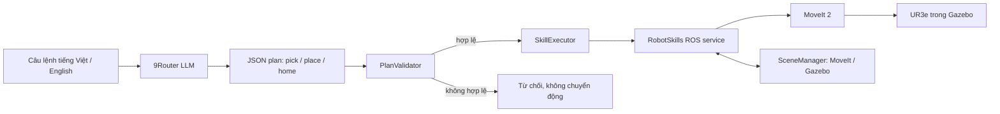

# Bài thực hành 02 — Điều khiển UR3e bằng LLM và Skill-based Planning

Ứng dụng ROS 2 Humble điều khiển robot UR3e mô phỏng trong Gazebo Fortress. Người dùng nhập yêu cầu bằng tiếng Việt hoặc tiếng Anh; 9Router tạo kế hoạch từ các robot skill được cho phép. Bộ kiểm tra xác nhận toàn bộ kế hoạch và trạng thái trước khi executor gọi skill. MoveIt lập kế hoạch chuyển động có xét va chạm và gửi quỹ đạo tới robot trong mô phỏng.

| Nền tảng | Giá trị |
|---|---|
| ROS 2 | Humble |
| Robot | UR3e, mô phỏng |
| Simulator | Gazebo Fortress |
| Motion planning | MoveIt 2 |
| Branch nộp bài | [`assignments_2`](https://github.com/kieudung12/HRI_k68e-re/tree/assignments_2) |

**Tài liệu nộp bài:** [Video demo](https://drive.google.com/file/d/1UAMJkEeRDNFUcW8BTuO_tXGWOzOB_zph/view?usp=sharing) · [Hướng dẫn trình bày](docs/PRESENTATION_GUIDE.md)


*Ảnh chụp scene mô phỏng ở trạng thái khởi tạo. Ảnh minh họa bố trí Gazebo, không đại diện cho một lần chạy LLM trực tiếp.*

## Nhiệm vụ sinh viên

| Sinh viên | MSSV | XX | P = XX mod 6 |
|---|---:|---:|---:|
| Kieu Minh Dung | 23020729 | 29 | 5 |

Mapping theo đề bài: **Zone A → Blue, Zone B → Yellow, Zone C → Red**. Mapping được tính từ [`config/student_config.yaml`](config/student_config.yaml) và được kiểm tra độc lập với đầu ra của LLM.

## Thiết kế hệ thống



LLM chỉ được chọn và sắp xếp ba skill: `pick(object)`, `place(object, zone)` và `home()`. Nó không tạo giá trị khớp, quỹ đạo, vận tốc, mã điều khiển hoặc lệnh controller. Trước khi chạy, `PlanValidator` kiểm tra schema chính xác, whitelist, thứ tự thao tác, trạng thái vật đang giữ, khay đã chiếm, mapping MSSV và trạng thái lỗi. Kế hoạch sai có thể được gửi lại cho LLM tối đa hai lần; mỗi kế hoạch mới vẫn phải qua validator. Kế hoạch rỗng là một yêu cầu từ chối và bị dừng ngay, không được tự bổ sung thao tác.

Các thành phần chính:

- `ur3_llm_control/llm_planner.py` — gửi yêu cầu tới 9Router và nhận JSON plan.
- `ur3_llm_control/task_validator.py` — kiểm tra tính hợp lệ của plan và trạng thái.
- `ur3_llm_control/skill_executor.py` — gọi từng skill theo thứ tự, dừng khi có lỗi.
- `src/robot_skills_node.cpp` — triển khai các skill bằng MoveIt.
- `src/scene_manager.cpp` — đồng bộ vật thể trong Gazebo và MoveIt Planning Scene.

## Cài đặt và build

Máy cần Ubuntu 22.04, ROS 2 Humble, MoveIt 2, Gazebo Fortress và workspace UR đã cài trong `~/ros2_ws`. Các phụ thuộc nền tảng này không được cài lại bởi package bài tập.

```bash
cd ~/HRI/ur3_LLM_b2
source /opt/ros/humble/setup.bash
source ~/ros2_ws/install/setup.bash
colcon build --symlink-install
source install/setup.bash
```

`build/`, `install/` và `log/` được giữ cục bộ để tái sử dụng kết quả build, đồng thời được Git ignore. Sau khi clone repo trên máy khác, chạy lại lệnh build ở trên.

## Chạy demo

### 1. Khởi động 9Router

Mở 9Router và xác nhận API tương thích OpenAI đang lắng nghe tại `http://localhost:20128/v1`. Trong terminal dùng để khởi chạy ROS, cấu hình endpoint và model rồi nhập API key khi được hỏi:

```bash
export NINEROUTER_BASE_URL=http://localhost:20128/v1
export NINEROUTER_MODEL=ag/gemini-3.8-flash-medium
read -rsp '9Router API key: ' NINEROUTER_API_KEY; echo
export NINEROUTER_API_KEY
```

Khi gõ hoặc dán key ở dấu nhắc `read -rsp`, terminal không hiển thị ký tự; nhấn Enter sau khi dán. Không ghi key vào mã nguồn, README, YAML hoặc tham số dòng lệnh. Các biến phải được đặt trong terminal chạy command server; export trong terminal client không truyền ngược sang server đã chạy.

### 2. Terminal 1 — khởi động robot và giao diện

```bash
cd ~/HRI/ur3_LLM_b2
source /opt/ros/humble/setup.bash
source ~/ros2_ws/install/setup.bash
source install/setup.bash
ros2 launch ur3_llm_control llm_robot.launch.py
```

Chạy lệnh này từ terminal đã cấu hình đủ ba biến 9Router. Chờ log xác nhận robot và scene đã sẵn sàng. Gazebo GUI và RViz được mở mặc định. Chỉ chạy một stack trên mỗi ROS domain.

### 3. Terminal 2 — gửi câu lệnh tự nhiên

Mở terminal mới và source workspace:

```bash
cd ~/HRI/ur3_LLM_b2
source /opt/ros/humble/setup.bash
source ~/ros2_ws/install/setup.bash
source install/setup.bash
```

Gửi yêu cầu tiếng Anh hoặc tiếng Việt:

```bash
ros2 run ur3_llm_control command_cli 'Please put the red cube in zone B.'
ros2 run ur3_llm_control command_cli 'Đưa khối màu đỏ vào vùng B.'
```

Ví dụ với nhiệm vụ sinh viên:

```bash
ros2 run ur3_llm_control command_cli --student-task \
  'Arrange all objects according to my student ID.'
```

CLI trình bày lệnh, kế hoạch, kết quả validation, trạng thái từng skill và trạng thái cuối. Với yêu cầu đặt khối đỏ vào B, plan hợp lệ có dạng:

```text
1. pick(red_cube)
2. place(red_cube, zone_b)
3. home()
```

`home()` đưa robot về tư thế `up` đã cấu hình và là bước cuối bắt buộc theo hợp đồng plan của bài.

## An toàn chuyển động và giới hạn mô phỏng

MoveIt chịu trách nhiệm IK, lập kế hoạch và kiểm tra va chạm. Các đoạn Cartesian chỉ được thực thi khi đường đi đạt điều kiện đầy đủ và vượt kiểm tra joint jump. Executor dừng tại skill đầu tiên thất bại. Cấu hình ưu tiên đường đi ngắn, có kiểm tra va chạm; project không tuyên bố tối ưu quỹ đạo toàn cục.

**Thao tác gắp là virtual grasp.** Mô hình UR3e hiện không có bộ điều khiển gripper vật lý. Khi gắp, MoveIt gắn cube vào `tool0` bằng `moveit_msgs/AttachedCollisionObject`; pose cube trong Gazebo được đồng bộ theo TCP. Mô phỏng này biểu diễn trạng thái đang giữ vật, không mô phỏng lực kẹp, ma sát, trượt hoặc gripper vật lý.

Scene và kích thước bàn, khối, khay được khai báo trong [`config/scene.yaml`](config/scene.yaml). Nếu một phép hoán đổi cần dùng khay tạm nhưng mọi khay đều đã có vật, bộ skill hiện tại không có vùng staging; validator sẽ từ chối kế hoạch trước khi robot chuyển động.

## Reset scene

Sau khi không còn vật được giữ và scene chưa fault, đưa robot về home và cube về vị trí nguồn mà không restart Gazebo:

```bash
ros2 run ur3_llm_control command_cli --reset-scene
```

Đây là tiện ích reset xác định, không gọi LLM và không phải robot skill.

## Tài liệu tham khảo kỹ thuật

Các liên kết sau là tài liệu dự án chính thức dùng để tra cứu công nghệ nền; chúng không hàm ý mã nguồn bài tập là bản sao của các dự án đó.

- [ROS 2 Humble Documentation](https://docs.ros.org/en/humble/) — hệ sinh thái ROS 2 và hướng dẫn theo distro.
- [MoveIt 2 Humble Documentation](https://moveit.picknik.ai/humble/) — lập kế hoạch chuyển động, Planning Scene và collision checking.
- [Gazebo Fortress Documentation](https://gazebosim.org/docs/fortress/) — simulator đang dùng trong workspace.
- [Gazebo `ros_gz` integration — nhánh Humble](https://github.com/gazebosim/ros_gz/tree/humble) — cầu nối ROS 2 và Gazebo.
- [Universal Robots Gazebo Simulation](https://github.com/UniversalRobots/Universal_Robots_ROS2_GZ_Simulation/tree/humble) — project mô phỏng Gazebo của nhà sản xuất; workspace này dùng package `ur_simulation_gz`.
- [Universal Robots ROS 2 Driver — nhánh Humble](https://github.com/UniversalRobots/Universal_Robots_ROS2_Driver/tree/humble) — driver ROS 2 chính thức và tài liệu hỗ trợ MoveIt. Repo bài tập này chạy UR3e trong mô phỏng, không kết nối robot thật.

## Tài liệu và liên kết nộp bài

- [Hướng dẫn trình bày](docs/PRESENTATION_GUIDE.md)
- [Danh mục file dự án](docs/FILES.md)
- [Mã nguồn trên GitHub — branch `assignments_2`](https://github.com/kieudung12/HRI_k68e-re/tree/assignments_2)
- [Video demo](https://drive.google.com/file/d/1UAMJkEeRDNFUcW8BTuO_tXGWOzOB_zph/view?usp=sharing)
