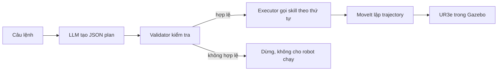

# Hướng dẫn trình bày Assignment 2

## Mục tiêu

Người dùng nhập câu lệnh tiếng Anh hoặc tiếng Việt. LLM chuyển câu lệnh thành một kế hoạch gồm các skill được cho phép. Chương trình kiểm tra kế hoạch trước khi robot chạy. MoveIt tính đường đi có xét va chạm và gửi lệnh tới UR3e trong Gazebo.

## Luồng chương trình



Có thể giải thích ngắn gọn: “LLM chỉ quyết định cần gọi skill nào. Validator kiểm tra kế hoạch. MoveIt mới tính chuyển động của robot.”

## Ba skill

- `home()`: đưa robot về tư thế `up` đã khai báo trong cấu hình UR.
- `pick(object)`: MoveIt đưa tool tới trên vật, hạ xuống, đánh dấu vật là đang được giữ, rồi rút tool lên.
- `place(object, zone)`: đưa vật tới trên khay, hạ xuống, đánh dấu vật đã được đặt, rồi rút tool lên.

Mô hình UR3e trong bài không có gripper thật. Việc gắp được mô phỏng bằng trạng thái attached trong MoveIt và đồng bộ pose khối trong Gazebo. Nên nói rõ đây là giả lập thao tác gắp, không phải mô phỏng lực kẹp.

Khi giải thích bố trí bàn: phải xét cả thân robot và cổ tay, không chỉ điểm `tool0`. Với hướng tool đang dùng, `wrist_1` nằm thấp hơn tool khoảng 8,5 cm và lệch ngang 9,2 cm. Bàn mới cao 8 cm; hàng phôi ở y=33 cm, hàng khay ở y=24 cm; khoảng cách gắp giả lập là 15 cm. Các vị trí này giúp cổ tay đi qua phía trên các vật còn lại. Thành khay có collision geometry trong cả Gazebo và MoveIt.

Khi thả, chương trình tính pose tool từ pose vật mong muốn và phép biến đổi đã đo lúc attach: `T_world_tool = T_world_object * inverse(T_tool_object)`. Vì vậy không được chỉ đổi quaternion của tool rồi cộng một khoảng Z cố định: làm như vậy có thể khiến phôi lệch khỏi vị trí thả. Chỉ detach khi sai số vị trí nhỏ hơn 5 mm và sai số góc nhỏ hơn 0,05 rad.

## Kiểm tra kế hoạch trước khi chạy

Validator xác nhận JSON chỉ có các skill và trường dữ liệu cho phép; vật và khay phải tồn tại; phải gắp trước khi đặt; chỉ đặt vật đang giữ; không đặt vào khay đã có vật; cuối kế hoạch phải có đúng một `home()`; và trạng thái robot không bị fault. Với bài sinh viên, trạng thái cuối phải khớp đủ mapping. Nếu plan LLM đầu tiên không đạt, chương trình gửi lỗi validator về cho LLM để tạo lại một lần; không tự chèn hay sửa skill. Chỉ plan đã được validator chấp nhận mới được chuyển tới executor. Nếu lần thử lại vẫn không đạt, executor không bắt đầu chuyển động.

Ví dụ lệnh cơ bản:

```text
Put the red cube in zone B.
```

Kế hoạch mong đợi:

```json
{"plan":[{"skill":"pick","object":"red_cube"},{"skill":"place","object":"red_cube","zone":"zone_b"},{"skill":"home"}]}
```

## Bài nâng cao theo mã sinh viên

Mã trong `config/student_config.yaml` là `23020729`. Lấy hai số cuối được `XX=29`; `P=29 mod 6=5`. Mapping tương ứng là:

| Khay | Vật |
|---|---|
| A | Xanh dương |
| B | Vàng |
| C | Đỏ |

Chương trình tính mapping bằng Python, đưa mapping đáng tin cậy cho planner và kiểm tra trạng thái cuối độc lập. LLM không tự tính modulo.

## Chạy demo

Sau khi build và khởi động 9Router cùng launch UR3e/Gazebo, mở terminal đã source workspace:

```bash
cd ~/HRI/ur3_LLM_b2
source /opt/ros/humble/setup.bash
source ~/ros2_ws/install/setup.bash
source install/setup.bash
```

Trước tiên xem LLM lập kế hoạch và validator chấp nhận kế hoạch mà chưa cho robot chạy:

```bash
ros2 run ur3_llm_control command_cli --student-task --dry-run
```

Khi kết quả là `VALIDATED_ONLY`, chạy bài thật:

```bash
ros2 run ur3_llm_control command_cli --student-task
```

Một task chỉ nên chạy một lần trên mỗi trạng thái scene. Nếu skill lỗi và robot báo `faulted`, dừng rồi khởi động lại toàn bộ launch để tạo scene sạch.

## Trả lời ngắn khi bảo vệ

**LLM có điều khiển khớp trực tiếp không?** Không. LLM chỉ tạo danh sách skill JSON; validator kiểm tra rồi MoveIt tính trajectory.

**Nếu LLM tạo kế hoạch sai thì sao?** Validator từ chối toàn bộ kế hoạch trước skill đầu tiên.

**MoveIt giúp gì?** Tính IK và trajectory, kiểm tra va chạm, gửi trajectory cho controller trong Gazebo.

**Điểm nâng cao là gì?** Chương trình đọc mã sinh viên, tính mapping bằng quy tắc cố định, yêu cầu LLM lập kế hoạch đạt mapping đó và kiểm tra trạng thái cuối.

**Gắp có giống robot thật không?** Chưa. Mô hình hiện tại không có gripper; trạng thái gắp là abstraction cho assignment.

## Phạm vi thiết kế

Bài tập chỉ cần ba skill và một pipeline có thể giải thích. Đoạn mang vật ưu tiên đường Cartesian thẳng khi không va chạm; cấu hình scene cũng đặt các khay đích gần vật nguồn theo mapping của sinh viên. Không cần thêm một framework tối ưu trajectory riêng để trình bày được yêu cầu cốt lõi.
